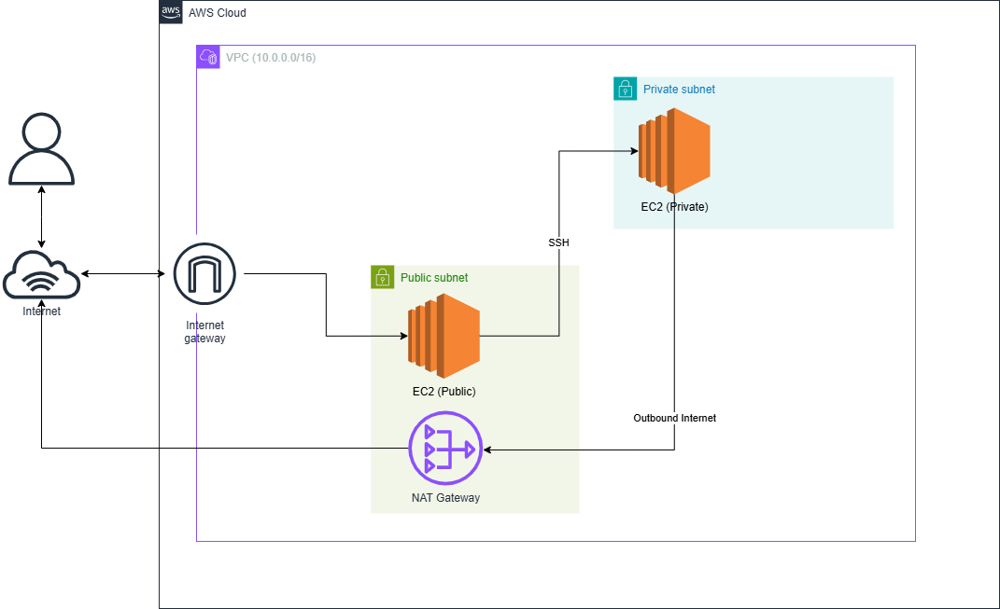
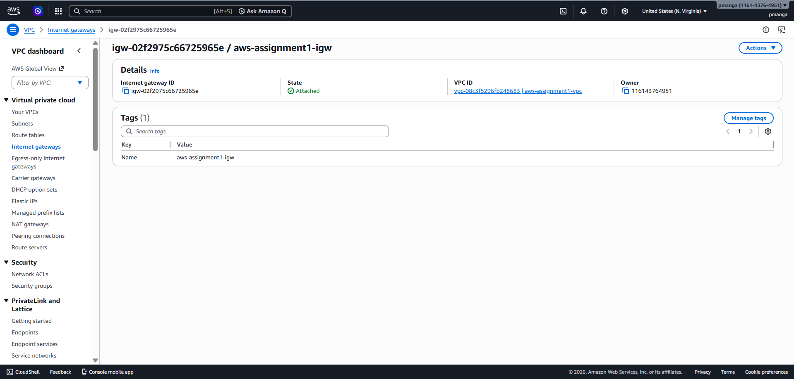
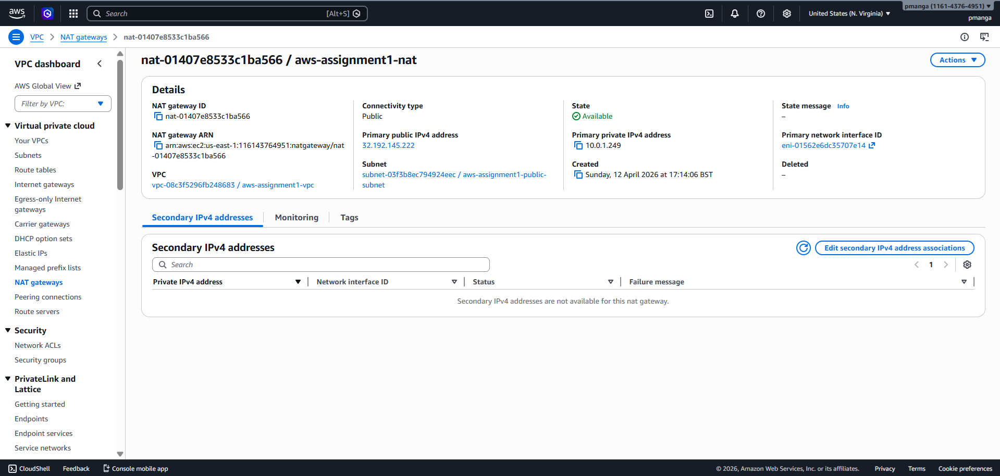
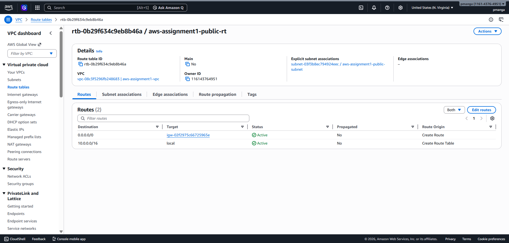
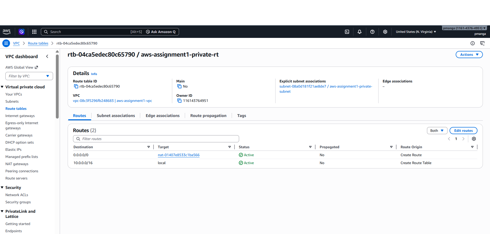
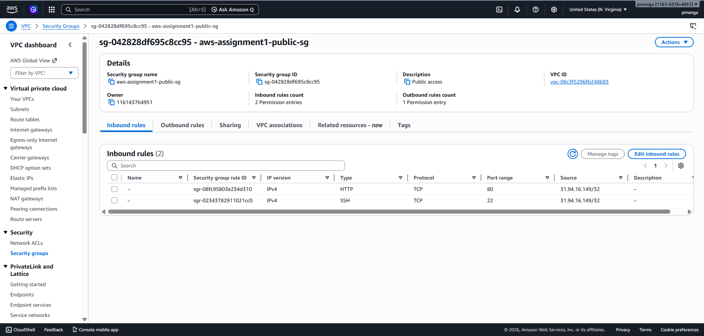
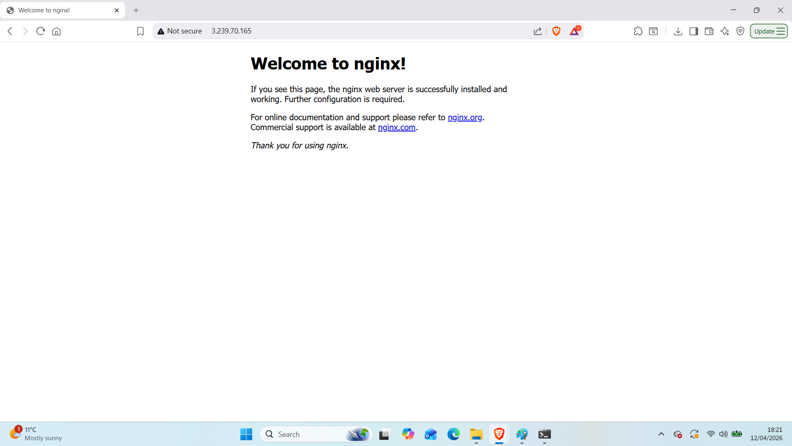
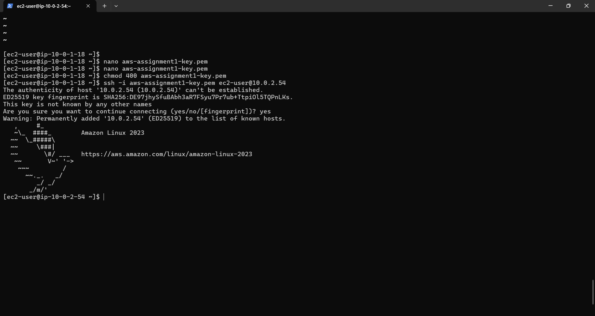

# AWS Assignment 1 – VPC & Networking

## Overview

This project demonstrates the creation of a custom Virtual Private Cloud (VPC) in AWS, designed to simulate a secure and structured real-world network.

The objective was not just to deploy resources, but to understand how traffic flows within AWS, how public and private access is controlled, and how different components interact to form a secure architecture.

---

## Architecture

The infrastructure consists of:

- A custom VPC (10.0.0.0/16)
- A Public Subnet (10.0.1.0/24)
- A Private Subnet (10.0.2.0/24)
- Internet Gateway (IGW) for public internet access
- NAT Gateway for private outbound internet access
- Public EC2 instance acting as a bastion host
- Private EC2 instance
- Security Groups controlling access between resources

---

## Architecture Diagram

---

## Key Design Decisions

### 1. Public vs Private Subnet Separation

The VPC was divided into a public and a private subnet to simulate a secure production-like environment.

- The **public subnet** hosts resources that need to be accessible from the internet.
- The **private subnet** hosts resources that must remain isolated and protected.

This separation is fundamental in real-world cloud architecture.

---

### 2. Internet Gateway (IGW)

An Internet Gateway was attached to the VPC to allow resources in the public subnet to communicate with the internet.

A route was configured:

- `0.0.0.0/0 → Internet Gateway`

This allows inbound and outbound internet traffic for the public subnet.

---

### 3. NAT Gateway

The NAT Gateway was placed in the **public subnet**, but used by the **private subnet**.

Its role is to allow:

- Outbound internet access from private instances
- While preventing inbound connections from the internet

This ensures that private resources remain secure but can still install packages, updates, or access external services.

---

### 4. Route Tables

Two route tables were configured:

#### Public Route Table
- Route: `0.0.0.0/0 → Internet Gateway`
- Associated with the public subnet

#### Private Route Table
- Route: `0.0.0.0/0 → NAT Gateway`
- Associated with the private subnet

This routing setup controls how traffic flows between internal and external networks.

---

### 5. Security Groups

Security Groups were used as virtual firewalls.

#### Public EC2 Security Group
- Allows SSH (port 22) from my IP
- Allows HTTP (port 80) for web access

#### Private EC2 Security Group
- Allows SSH only from the public EC2 instance

This ensures:
- Controlled external access
- Secure internal communication

---

## Testing and Validation

### Public EC2 Access

A web server (NGINX) was installed on the public EC2 instance.

This confirmed:
- Internet Gateway is working
- Public route table is correctly configured
- Security group allows HTTP access

---

### SSH Access to Private EC2

The private EC2 instance was accessed via SSH from the public EC2 instance.

This confirmed:
- Private EC2 is not publicly accessible
- Internal communication is correctly configured
- Security group rules are enforced properly

---

### NAT Gateway Functionality

The private EC2 instance was able to access external resources through the NAT Gateway.

This validated:
- Private route table configuration
- NAT Gateway setup
- Outbound-only internet access from private subnet

---

## Key Learnings

Through this project, I developed a strong understanding of:

- VPC design and network segmentation
- Differences between public and private subnets
- How Internet Gateway and NAT Gateway function
- Traffic flow using route tables
- Secure access patterns using bastion hosts
- Security group configuration and enforcement

---

## Summary

This project demonstrates a foundational AWS networking setup used in real-world environments.

It highlights how to design a secure architecture where:
- Public resources are accessible when required
- Private resources remain protected
- Traffic is controlled through routing and security rules

This forms the basis for more advanced cloud architectures involving load balancing, auto-scaling, and multi-tier applications.
