# AWS Assignment 2 – Highly Available Web Application with ALB and Auto Scaling

---

## Overview

This project demonstrates the deployment of a highly available and scalable web application on AWS.

The architecture uses:
- Application Load Balancer (ALB)
- Auto Scaling Group (ASG)
- EC2 instances across multiple Availability Zones
- Route 53 for DNS routing
- AWS Certificate Manager (ACM) for HTTPS
- Security Groups for controlled access

The goal was to ensure:
- High availability
- Load distribution across instances
- Secure traffic flow
- Fault tolerance

---

## Architecture

The application follows a layered architecture:

User → Route 53 → Application Load Balancer → Target Group → Auto Scaling Group → EC2 instances

- The Application Load Balancer is deployed across multiple public subnets
- EC2 instances are hosted in private subnets across two Availability Zones
- The Auto Scaling Group ensures availability and automatic recovery
- HTTPS is enforced at the load balancer using an ACM certificate

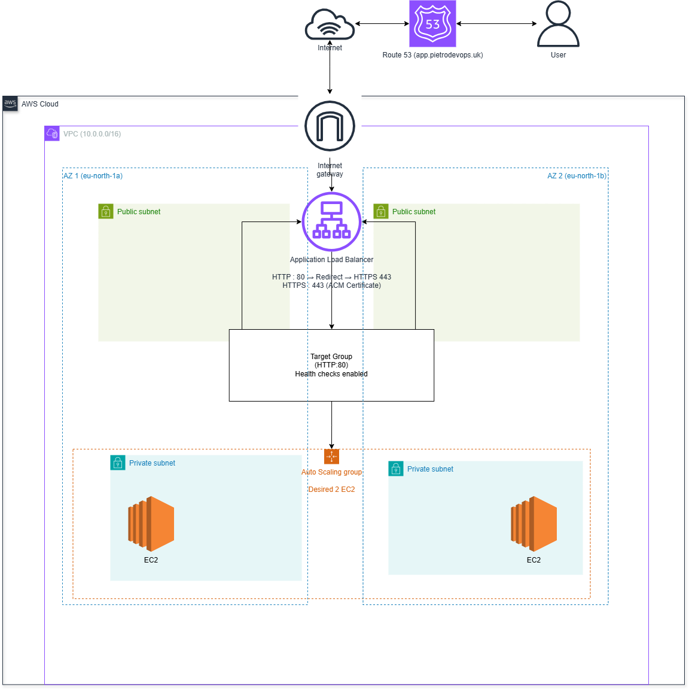

---

## 1. Launch Template

A launch template was created to standardise EC2 instance configuration.

It defines:
- AMI
- Instance type (t3.micro)
- Security group
- User data (web server setup)

This ensures consistency across all instances launched by the Auto Scaling Group.

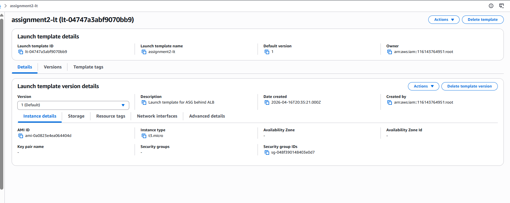

---

## 2. Auto Scaling Group

An Auto Scaling Group was configured to maintain application availability.

Key configuration:
- Desired capacity: 2 instances
- Multiple Availability Zones
- Launch template attached

This ensures the application remains available even if one instance fails.

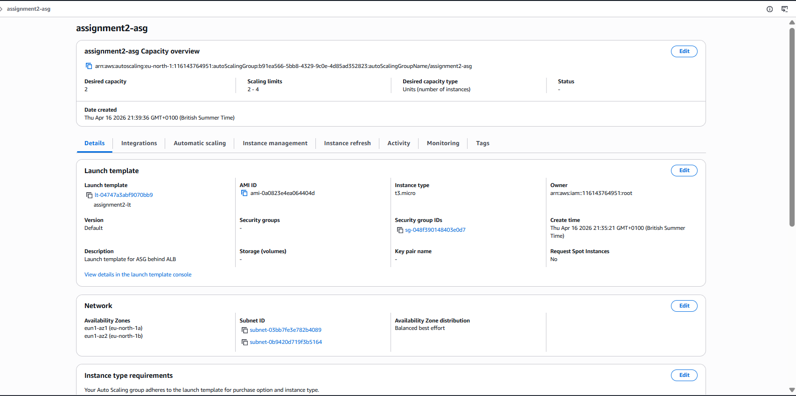

---

## 3. EC2 Instances

Two EC2 instances were launched automatically by the Auto Scaling Group.

They are distributed across different Availability Zones for high availability.

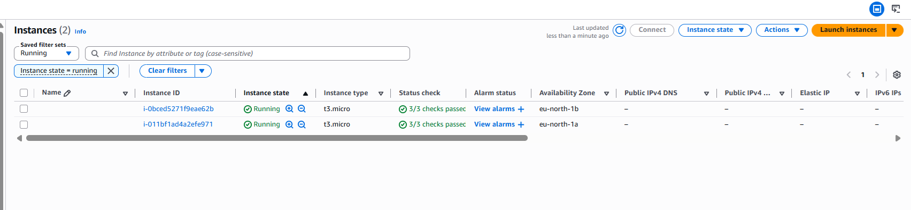

---

## 4. Target Group

A target group was created to register EC2 instances and route traffic.

Health checks ensure only healthy instances receive traffic.

The target group acts as the logical bridge between the load balancer and EC2 instances:
- The ALB forwards incoming requests to the target group
- The target group distributes traffic to registered EC2 instances
- Only instances passing health checks are included in rotation

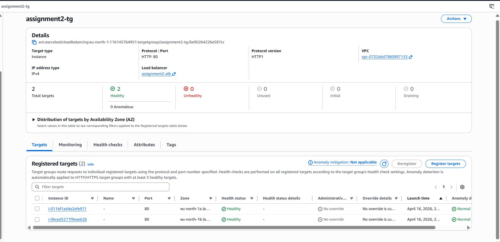

---

## 5. Application Load Balancer

An internet-facing Application Load Balancer was configured.

It distributes incoming traffic across multiple EC2 instances.

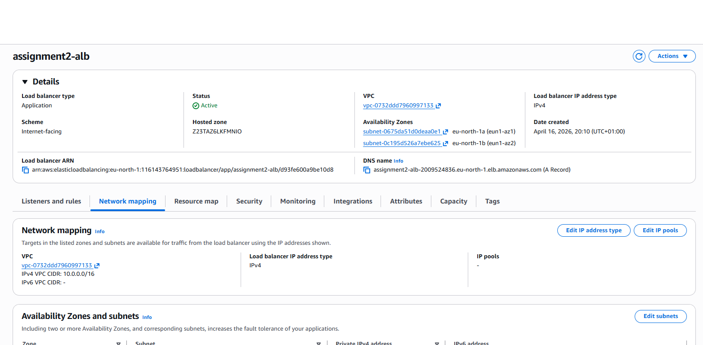

---

## 5.1 HTTPS and ACM Certificate

HTTPS was configured to ensure secure communication between the user and the application.

Steps performed:
- An SSL certificate was created using AWS Certificate Manager (ACM)
- Domain ownership was validated via DNS (Route 53 CNAME record)
- The certificate was attached to the ALB HTTPS listener (port 443)

Additionally:
- HTTP (port 80) was configured to automatically redirect to HTTPS
- This ensures all traffic is encrypted by default

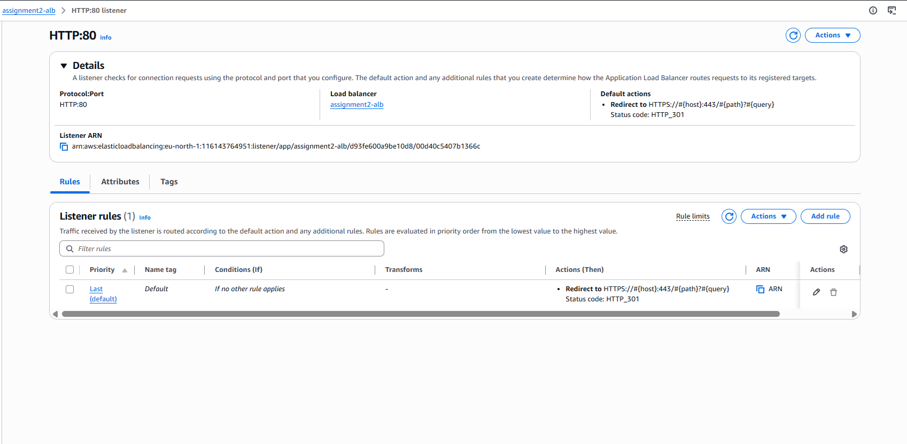
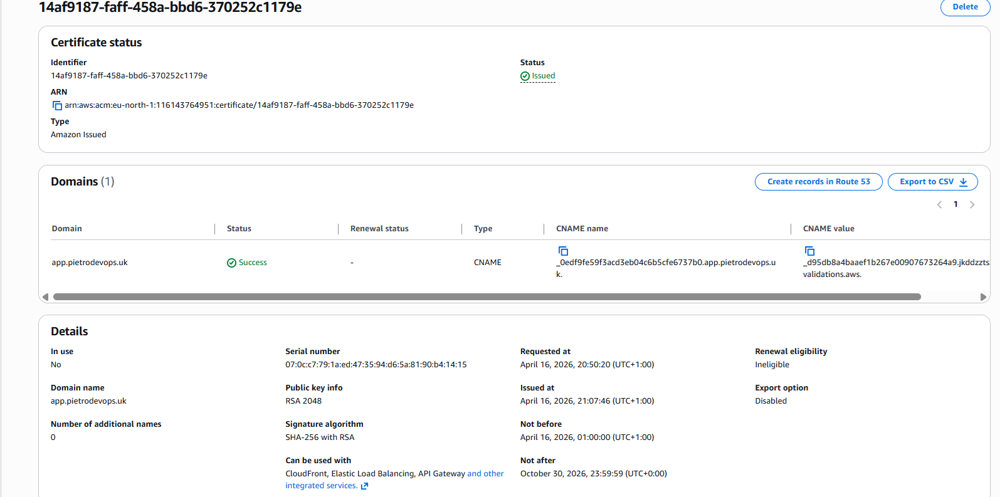

---

## 6. Route 53

A Route 53 hosted zone was configured to route traffic to the ALB.

This allows access via a custom domain instead of raw IP.

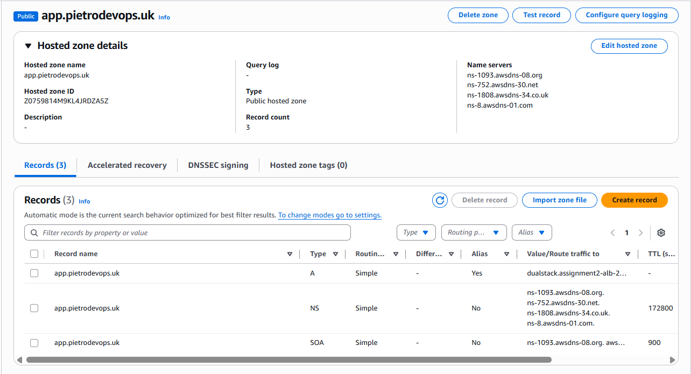

This setup allows Route 53 to act as the entry point for traffic, resolving the domain to the ALB while maintaining flexibility in DNS management.

---

## 7. Security Groups

Two security groups were configured:

ALB Security Group:
- Allows HTTP (80) and HTTPS (443) from the internet

EC2 Security Group:
- Allows HTTP traffic only from the ALB security group

This ensures secure, controlled traffic flow.

This layered approach ensures:
- No direct public access to EC2 instances
- All traffic must pass through the load balancer
- Reduced attack surface and improved security posture

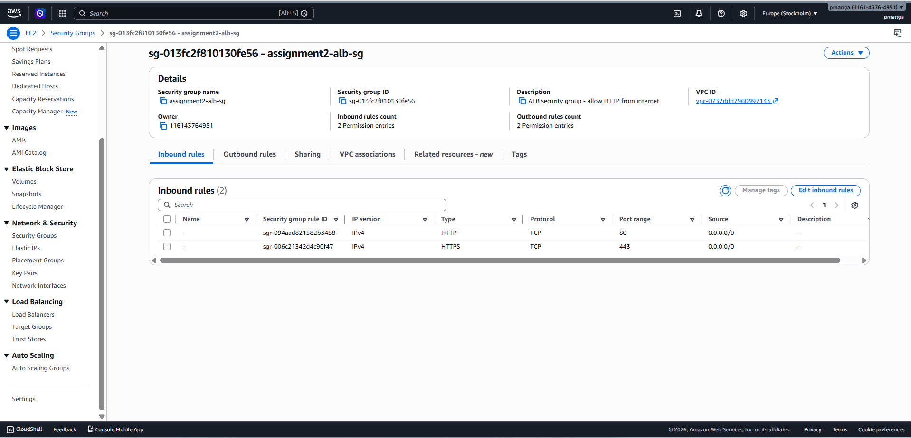
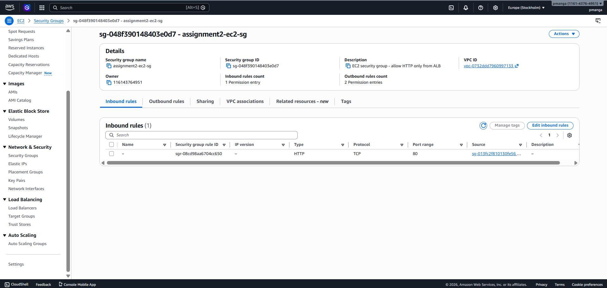

---

## 8. Load Balancing Validation

The application was tested through the domain.

Responses from different instances confirm that the load balancer is distributing traffic correctly.

---

## 9. DNS Integration (Cloudflare to Route 53)

The domain used for this project was originally managed through Cloudflare.

To integrate with AWS:
- A hosted zone was created in Route 53
- The Application Load Balancer DNS was configured as an alias record
- Traffic was routed from the domain to the ALB endpoint

This demonstrates an understanding of real-world DNS setups where:
- External DNS providers (Cloudflare) are used
- AWS Route 53 is integrated for resource-level routing

This approach allows flexibility in managing domains while leveraging AWS infrastructure.

---

## 10. Resilience and Auto Scaling Validation

To verify system reliability, the Auto Scaling Group behaviour was tested.

Two validation methods were used:

1. Manual Instance Termination  
One EC2 instance was manually terminated.  
The Auto Scaling Group automatically launched a new instance to maintain the desired capacity.

2. Load Distribution Testing  
Multiple requests were sent through the domain.  
Responses alternated between Instance 1 and Instance 2, confirming proper load balancing.

These tests confirmed:
- Self-healing infrastructure
- High availability
- Correct ASG configuration

This testing confirmed that the system is not only functional, but resilient under failure conditions, which is a key requirement in production environments.

---

## Traffic Flow

1. User accesses the domain via browser  
2. Route 53 resolves the domain to the ALB  
3. HTTP requests are redirected to HTTPS  
4. The ALB forwards traffic to the target group  
5. The target group routes requests to healthy EC2 instances  
6. The response is returned to the user via the ALB  

This flow ensures secure, controlled, and scalable traffic handling.

---

## Engineering Approach

This project was built with a focus on understanding system behaviour rather than only completing the setup.

Key considerations during the build:
- Ensuring traffic flows securely (ALB → EC2 only)
- Designing for failure (multi-AZ + ASG)
- Validating outcomes through testing, not assumptions
- Integrating external DNS (Cloudflare) with AWS services

The goal was not only to deploy infrastructure, but to understand how each component interacts within a production-like environment.

---

## Key Concepts Demonstrated

- High Availability using multiple Availability Zones
- Load Balancing with ALB
- Auto Scaling for resilience
- Health checks for reliability
- DNS routing with Route 53
- HTTPS enforcement using ACM
- Security best practices using layered Security Groups

---

## Outcome

The system successfully:
- Distributes traffic across multiple EC2 instances
- Maintains availability even if one instance fails
- Provides a scalable, secure, and production-style architecture
