# AWS Assignment 3 – Static Website Hosting with S3, CloudFront and DNS Delegation

---

## Overview

This project demonstrates how to host a static website using AWS S3 and deliver it securely and globally using CloudFront, while managing DNS through both Cloudflare and Route 53.

The goal was to build a simple but realistic architecture that reflects how services are actually used together in production.

---

## Architecture

User → Cloudflare → Route 53 → CloudFront → S3

- S3 stores the static website  
- CloudFront delivers the content globally (CDN)  
- Route 53 handles AWS-side DNS (subdomain delegation)  
- Cloudflare manages the main domain DNS externally  

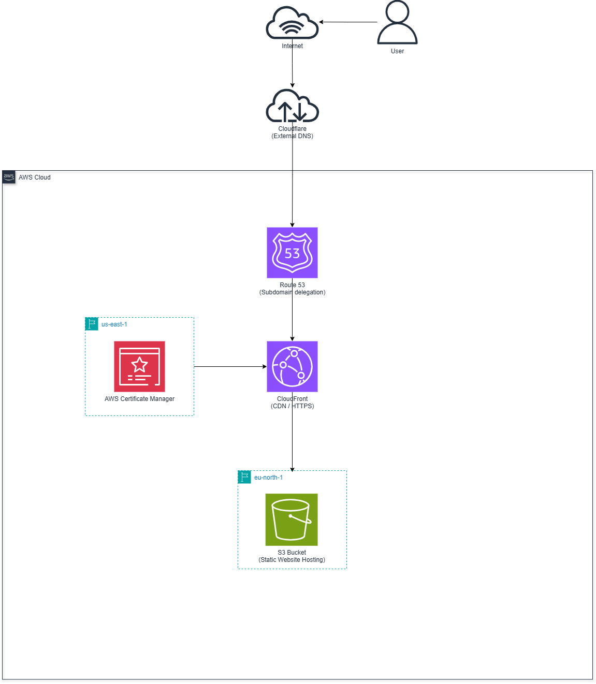

---

## 1. S3 Bucket Setup

An S3 bucket was created to host the static website.

Key configurations:
- Static website hosting enabled  
- index.html and error.html configured  
- Public access enabled via bucket policy  

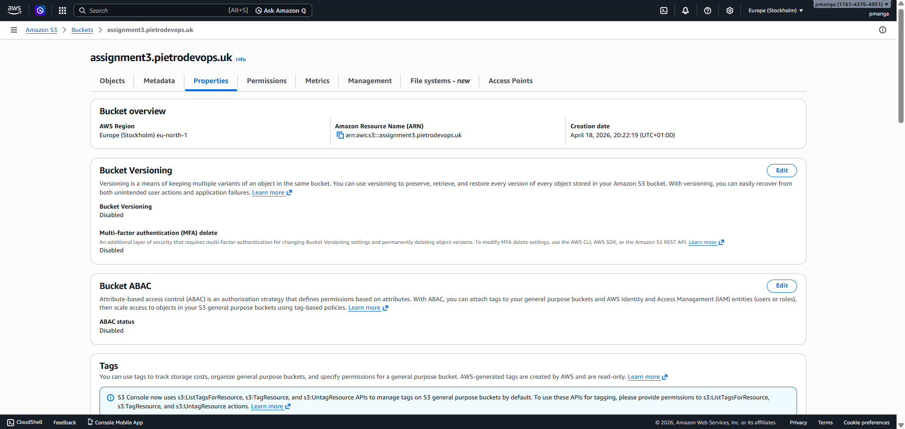

---

## 2. Uploading Website Files

The website files were uploaded to the S3 bucket.

This included:
- index.html  
- error.html  

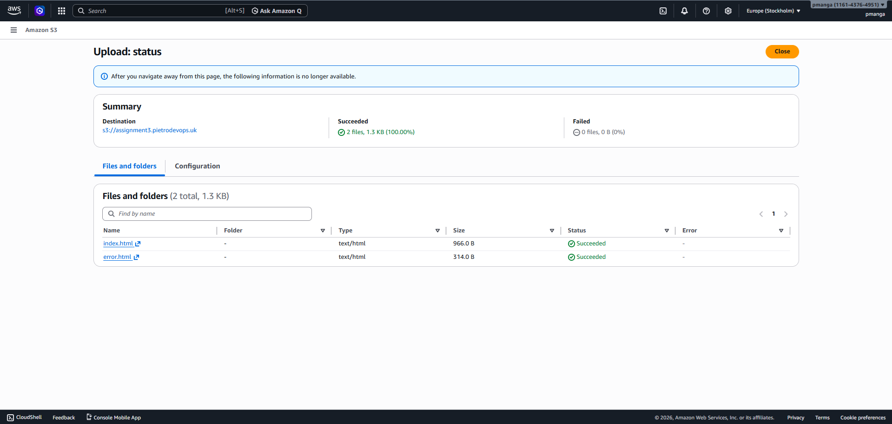

---

## 3. Bucket Policy (Public Access)

A bucket policy was applied to allow public read access.

Policy used:

Version: 2012-10-17  
Effect: Allow  
Principal: *  
Action: s3:GetObject  
Resource: arn:aws:s3:::assignment3.pietrodevops.uk/*  

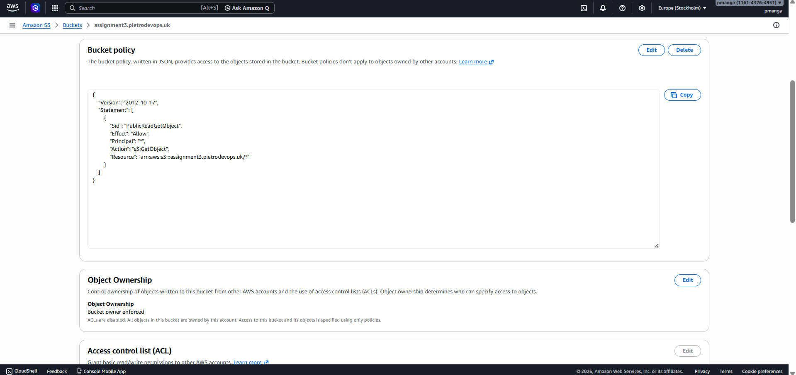

---

## 4. Testing S3 Website Endpoint

The S3 static website endpoint was tested directly.

This confirms:
- The site is working  
- S3 is correctly serving the content  

Note: This endpoint is not secure (HTTP only)

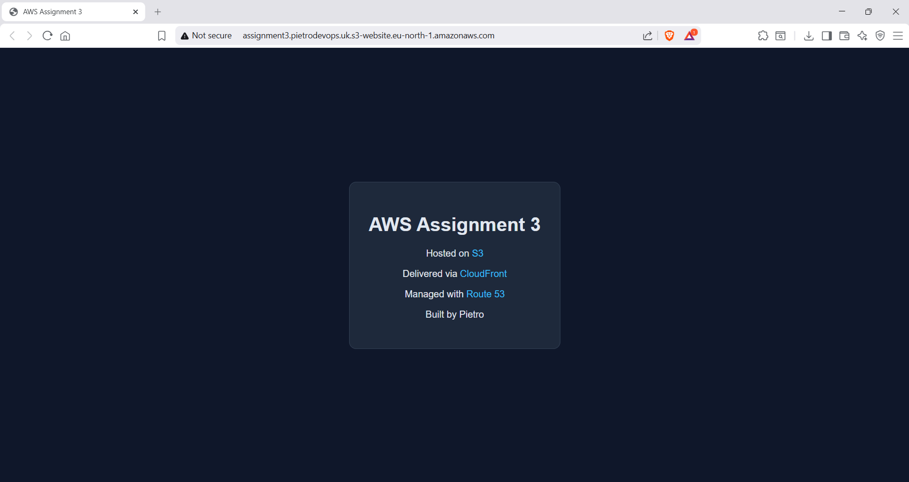

---

## 5. CloudFront Distribution

A CloudFront distribution was created to sit in front of S3.

Key configurations:
- Origin: S3 bucket  
- Viewer protocol: Redirect HTTP to HTTPS  
- Default root object: index.html  
- Global edge locations enabled  

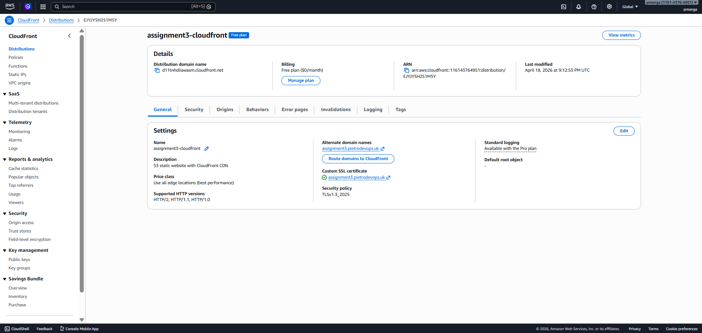

---

## 6. Testing CloudFront

The CloudFront domain was tested directly.

This confirms:
- CDN is working  
- Content is delivered over HTTPS  

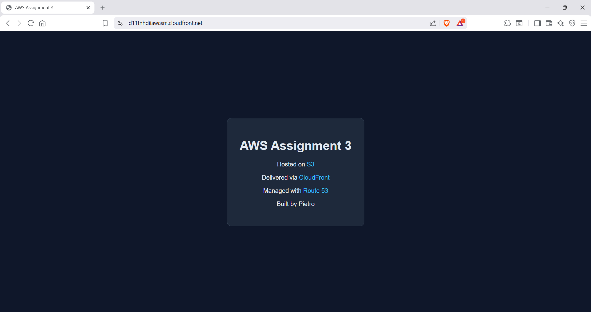

---

## 7. SSL Certificate (ACM)

An SSL certificate was requested and validated using AWS Certificate Manager.

Key points:
- Domain: assignment3.pietrodevops.uk  
- Validation via DNS  
- Attached to CloudFront  

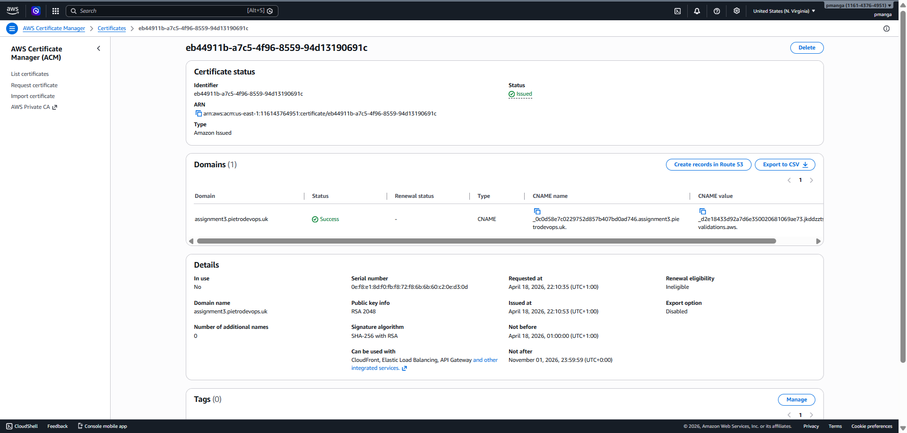

---

## 8. Route 53 Hosted Zone (Subdomain Delegation)

A hosted zone was created in Route 53 for:

assignment3.pietrodevops.uk

This was used specifically to:
- Delegate control of the subdomain to AWS  
- Connect CloudFront to the custom domain  

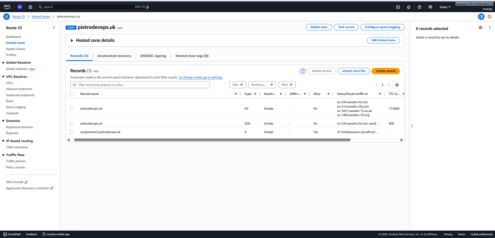

---

## 9. Cloudflare DNS Configuration

Cloudflare was used as the main DNS provider for the root domain.

Key setup:
- NS records added for assignment3 subdomain  
- Delegated to Route 53 nameservers  

This allowed:
Cloudflare → Route 53 → CloudFront → S3 flow

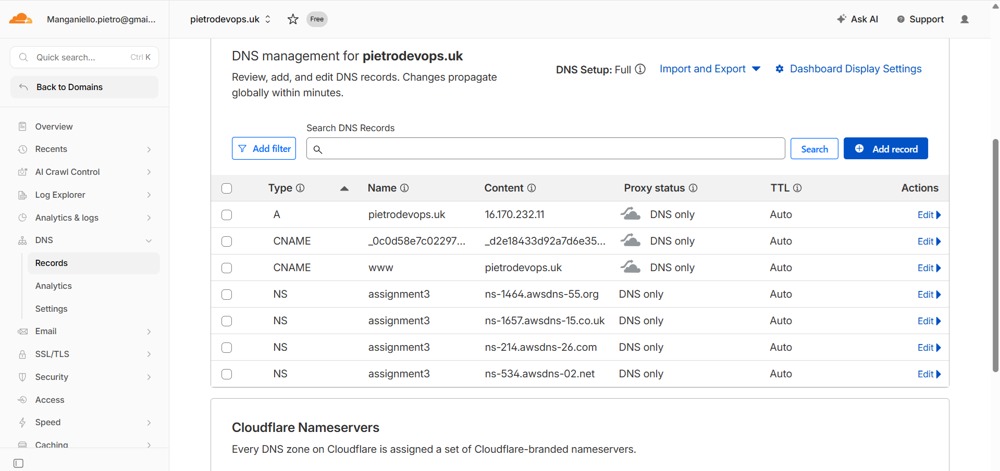

---

## 10. Final Website (Custom Domain)

The final website was accessed via:

https://assignment3.pietrodevops.uk

This confirms:
- DNS resolution is correct  
- SSL certificate is working  
- CloudFront is delivering content from S3  

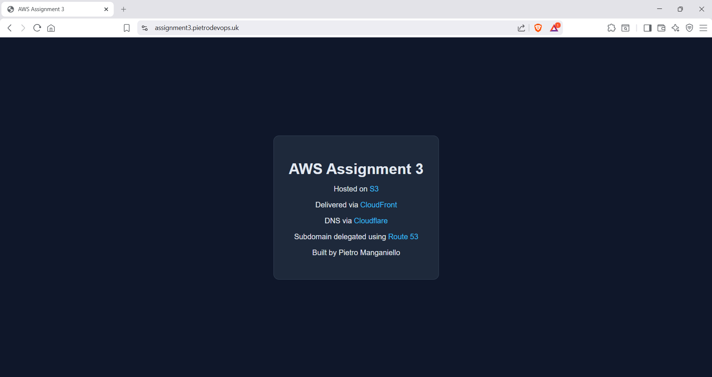

---

## Key Learning Points

This project helped reinforce several important concepts:

- Separation of concerns between services  
- How CDNs improve performance and security  
- Real-world DNS delegation between providers  
- Importance of HTTPS and certificate management  
- Understanding the full request flow end-to-end  

---

## Reflection

One key takeaway from this project was understanding how multiple systems interact together rather than working in isolation.

Initially, it might seem like S3 alone is enough to host a website, but introducing CloudFront improves performance and security significantly.  

Using both Cloudflare and Route 53 also highlighted how DNS can be split across providers depending on requirements.

This project helped connect all the dots between storage, networking, and delivery.

---

